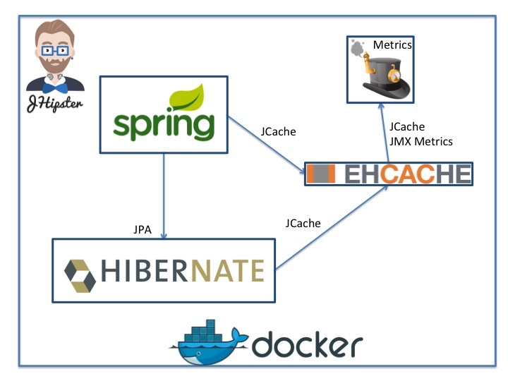

# Full-stack sample

The sample features Ehcache used in a full-stack enterprise architecture.



The interesting points are:
* Spring using Ehcache through JCache (JSR-107)
  * [application-dev.xml](src/main/resources/config/application-dev.yml), [application-prod.xml](src/main/resources/config/application-prod.yml): Spring JCache configuration
  * [ehcache.xml](src/main/resources/ehcache.xml): Ehcache configuration
* Hibernate 5 reusing the same `CacheManager` as Spring through JCache  
  * [application-dev.xml](src/main/resources/config/application-dev.yml), [application-prod.xml](src/main/resources/config/application-prod.yml): Hibernate cache provider configuration
  * [SpringCacheRegionFactory.java](src/main/java/org/terracotta/demo/config/jcache/SpringCacheRegionFactory.java): Hibernate region factory linked with Spring
* Push JCache JMX metrics to [Dropwizard Metrics](http://metrics.dropwizard.io)
  * [MetricsConfiguration.java](src/main/java/org/terracotta/demo/config/MetricsConfiguration.java)
  * [JCacheGaugeSet.java](src/main/java/org/terracotta/demo/config/JCacheGaugeSet.java)
* Ehcache clustered configuration for production
  * [ehcache-clustered.xml](src/main/resources/ehcache-clustered.xml): Ehcache clustered configuration
  * [application-prod.xml](src/main/resources/config/application-prod.yml): Clustered configuration in Spring 
* Teracotta server deployed with Docker
  * [terracotta-server-yml](src/main/docker/terracotta-server.yml): Docker Compose for Terracotta server

This application was generated using JHipster, you can find documentation and help at [https://jhipster.github.io](https://jhipster.github.io).

## The application

The idea behind the application is to be able to search through a list of actors and then see the
meteo on his/her date or birth and location.

### Usage

* Open the application home page
* Log yourself as admin/admin
* Go to the Demo->Stars menu
* Click on the little cloud button on any of the actors

### Caching

To provide the actor details, we need
* To retrieve its record from the database 
* Call Google Maps API to get the coordinates of the city of birth (see [CoordinatesService.java](src/main/java/org/terracotta/demo/service/CoordinatesService.java))
* Call the Darksky API to get the weather at this place and time (see [WeatherService.java](src/main/java/org/terracotta/demo/service/WeatherService.java))

Caching occurs in two places:
* Spring level using JCache annotations in `WeatherService`
* Hibernate second-level cache on actors

## Environment

This application requires Java 8 to run. Having [Docker](https://www.docker.com/) is necessary to run the production setup. Node.js is used
for compilation and development.

### Required environment variables

To be able to access the web services correctly, you will need these environment variables:

* DEMO_GOOGLEAPIKEY
* DEMO_DARKSKYAPIKEY

Often, it's a easy as running this command in your shell :

```bash
export DEMO_GOOGLEAPIKEY=insert_key_here
export DEMO_DARKSKYAPIKEY=insert_key_here
```

### Install Node and Gulp

Before you can build this project, you must install and configure the following dependencies on your machine:

1. [Node.js](https://nodejs.org): We use Node to run a development web server and build the project.
   Depending on your system, you can install Node either from source or as a pre-packaged bundle.

After installing Node, you should be able to run the following command to install development tools (like
[Bower](https://bower.io) and [BrowserSync](https://www.browsersync.io)). You will only need to run this command when dependencies change 
in `package.json`.

    npm install

We use [Gulp](http://gulpjs.com) as our build system. Install the Gulp command-line tool globally with:

    npm install -g gulp

## Development

Run the following commands in two separate terminals to create a blissful development experience where your browser
auto-refreshes when files change on your hard drive.

    ./mvnw
    gulp

Bower is used to manage CSS and JavaScript dependencies used in this application. You can upgrade dependencies by
specifying a newer version in `bower.json`. You can also run `bower update` and `bower install` to manage dependencies.
Add the `-h` flag on any command to see how you can use it. For example, `bower update -h`.

## Building for production

To optimize the demo client for production, run:

    ./mvnw -Pprod clean package

This will concatenate and minify CSS and JavaScript files. It will also modify `index.html` so it references
these new files.

To ensure everything worked, run:

    java -jar target/*.war

Then navigate to [http://localhost:8080](http://localhost:8080) in your browser.

## Testing

Unit tests are run by [Karma][] and written with [Jasmine][]. They're located in `src/test/javascript/` and can be run with:

    gulp test

Performance tests are run by [Gatling]() and written in Scala. They're located in `src/test/gatling` and can be run with:

    ./mvnw gatling:execute
    
## Execution

You can run your application locally with

    mvn spring-boot:run
    
If you want to use a local production database in Docker 

    docker-compose -f src/main/docker/postgresql.yml up
    ./mvnw spring-boot:run -Pprod

Or if you want everything in Docker

    ./mvnw package -Pprod docker:build
    docker-compose -f src/main/docker/app.yml up
    
And the start your application locally 

## Docker

### Docker and docker compose instructions provided by JHipster

On a single docker host ([such as Docker 4 mac or Docker 4 Windows](https://www.docker.com/products/docker)), or a pre 1.12 swarm, let's suppose you want to deploy your db, your terracotta server and several instances of your webapp

First,[read the jhipster doc](https://jhipster.github.io/docker-compose/); that basically means :

Build your app, and its docker image :

    ./mvnw package -Pprod docker:build
    
Start everything up :
    
    docker-compose -f src/main/docker/app.yml up

And hit [http://localhost:9000](http://localhost:9000)
    
So you wanna "scale"? Sure, go ahead, but before, make sure to remove the port binding in `app.yml` for demo-app, or make sure that 
each container will be started on a different swarm node, or else you'll hit :
    
    $ docker-compose -f src/main/docker/app.yml  scale demo-app=3
    WARNING: The "demo-app" service specifies a port on the host. If multiple containers for this service are created on a single host, the port will clash.
    Creating and starting docker_demo-app_2 ... error
    Creating and starting docker_demo-app_3 ... error

Let's try again without port clashing :
       
    $ docker-compose -f src/main/docker/app.yml scale demo-app=3
    $ docker-compose -f src/main/docker/app.yml ps
             Name                       Command               State                Ports               
    --------------------------------------------------------------------------------------------------
    demo-postgresql          /docker-entrypoint.sh postgres   Up      0.0.0.0:5432->5432/tcp           
    demo-terracotta-server   /bin/sh -c sed -i -r 's/OF ...   Up      0.0.0.0:9510->9510/tcp, 9530/tcp 
    docker_demo-app_1        /bin/sh -c echo "The appli ...   Up      0.0.0.0:9000->8080/tcp           
    docker_demo-app_2        /bin/sh -c echo "The appli ...   Up      0.0.0.0:32769->8080/tcp          
    docker_demo-app_3        /bin/sh -c echo "The appli ...   Up      0.0.0.0:32768->8080/tcp  
    
Feeling curious? Nice, go and have a look at src/main/docker, everything is there.

### Docker swarm mode (1.12+) and overlay network (theory, not verified yet)  

After setting up a Docker swarm with several nodes (docker hosts), the idea is to have :

* a postgresql service, replicas=1
* a terracotta-server service, replicas=1
* a demo-app service, replicas=n 

First, create a common network :

    docker network create -d overlay my-network

Start the postgresql service :

    docker service create --name=postgresql --replicas=1--network=my-network postgres:9.5.4

Start the terracotta-server service :

    docker service create --name=terracotta-server --replicas=1 --network=my-network anthonydahanne/terracotta-server-oss:5.0.0

Start several webapp instances :

    docker service create --name=demo-app --replicas=5 --network=my-network demo
    
Verify everything is fine with :
    
    docker service ls
